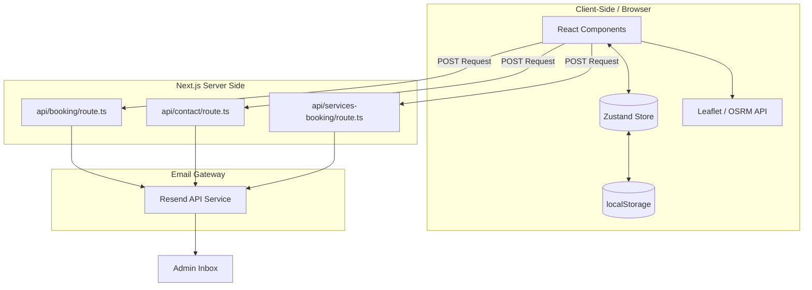

# RADHIL-33 / RTT - Architectural Analysis & Mental Model

This document provides a comprehensive analysis of the **Rashmi Tours & Travels** codebase, establishing a solid mental model of the system's architecture, patterns, features, and technical debt prior to writing or modifying any code.

---

## 1. Project Overview

*   **Application Scope:** Rashmi Tours & Travels is a web-based booking portal and content management system (CMS) for a premium cab service in Trichy (Tiruchirappalli) specializing in outstation travel, pilgrimages, and hill station tours across South India.
*   **Target Users:** 
    1.  *Travelers:* Customers looking to explore South India, estimate cab fares for specific routes, plan itinerary, book hotels/dining, and submit booking requests.
    2.  *Administrators:* Internal staff who manage site content (carousel banners, packages, coupons, testimonials, and fare rules) via a private, hidden admin CMS.
*   **Tech Stack:**
    *   **Core:** React 19, Next.js 16.2.6 (App Router)
    *   **Styling:** Tailwind CSS v4, PostCSS, Vanilla CSS, inline styles, scoped component styles
    *   **Theme:** Heritage Navy (`#0B2344`), mid-navy (`#102A4A`), dark navy (`#071523`), Gold (`#D4AF37`), gold-light (`#E8C84A`), Ivory (`#F8F6F0`), Ivory-dark (`#F0EDE4`), Graphite (`#2E3138`), Slate (`#7B93AC`)
    *   **State Management:** Zustand 5.0.13 with persistent client storage (`localStorage` middleware)
    *   **Forms:** React Hook Form (installed in dependencies but forms are currently written as standard controlled React state)
    *   **Email Dispatch:** Resend 6.12.3 (Server-side API routes)
    *   **Maps & Routing:** Leaflet 1.9.4 with OSRM (Open Source Routing Machine) API
    *   **Animations:** Framer Motion 12.38.0
    *   **Icons:** Lucide React 1.16.0
*   **Package Manager:** npm (utilizes `package-lock.json`)
*   **Deployment:** Standard Vercel deployment model (optimized for Next.js)

---

## 2. Repository Structure

```
rtt/
├── app/                      # Next.js App Router root (Pages, Layouts, API Routes)
│   ├── admin/                # Private Administration Portal pages
│   │   ├── carousel/         # CMS Carousel Slide editor
│   │   ├── coupons/          # CMS Coupon Code manager
│   │   ├── dashboard/        # CMS Dashboard landing with site metrics
│   │   ├── fares/            # CMS Fare Rule editor (defines route prices)
│   │   ├── packages/         # CMS Tour Package manager
│   │   ├── testimonials/     # CMS Testimonials manager
│   │   ├── textblocks/       # CMS Home Page static text blocks editor
│   │   ├── layout.tsx        # Client-side admin verification and layout wrapper
│   │   └── page.tsx          # Admin login portal page
│   ├── api/                  # Server-side API endpoints (Resend email dispatchers)
│   │   ├── booking/          # Handles cab booking requests
│   │   ├── contact/          # Handles general contact form submissions
│   │   └── services-booking/ # Handles hotel/dining booking inquiries
│   ├── booking/              # Cab booking checkout page
│   ├── contact/              # Contact info & feedback page
│   ├── hotels-restaurants/   # Hotel and restaurant partner listings
│   ├── itinerary/            # Interactive custom itinerary planner with Map
│   ├── globals.css           # Tailwind v4 import & Global custom tokens/utilities
│   ├── layout.tsx            # Global site layout, metadata, fonts, Toast wrapper
│   ├── page.tsx              # Public facing Home Page
│   └── vehicles/             # Fleet listing & comparison page
├── components/               # Reusable React components
│   ├── admin/                # Admin-specific navigation sidebar
│   │   └── AdminSidebar.tsx  # Sidebar navigation for the CMS
│   ├── sections/             # Modular section components for the Home Page
│   │   ├── FareEstimator.tsx     # Calculates route-based cost estimates
│   │   ├── HeroCarousel.tsx      # Main image slider on the home page
│   │   ├── VehiclesCarousel.tsx  # Horizontal vehicle fleet slider
│   │   ├── PackagesSection.tsx   # Displays tour packages
│   │   ├── QuickBookCTA.tsx      # CTA bar driving calls / WhatsApp / booking
│   │   ├── TestimonialsSection.tsx# Customer review carousel
│   │   └── WhyUsSection.tsx      # Core value propositions
│   ├── Footer.tsx            # Main footer (navigation links & contact details)
│   ├── Map.tsx               # Leaflet map component (runs on client only)
│   └── Navbar.tsx            # Responsive navigation bar (desktop & mobile)
├── lib/                      # Library & site utility functions
│   ├── siteData.ts           # Central site data types & default initial datasets
│   └── vehicles.ts           # Vehicles metadata and specs
├── public/                   # Static public assets (icons, illustrations)
│   └── Radhil Long.png       # Branded favicon image
├── store/                    # Frontend state store
│   └── useSiteStore.ts       # Zustand store with persistence for CMS data
├── eslint.config.mjs         # Linter settings
├── next.config.ts            # Next.js bundler and server settings
├── package.json              # Package definition
├── tsconfig.json             # TypeScript rules
└── AGENTS.md / CLAUDE.md     # System development rules and helper guidelines
```

### Entry Points & Asset Types
*   **Public Entry Point:** `app/page.tsx`
*   **Admin Entry Point:** `app/admin/page.tsx`
*   **Routing entry:** Managed automatically by the Next.js App Router directories.
*   **Handwritten Code:** Virtually all files in `app/`, `components/`, `lib/`, and `store/` are handwritten source files.
*   **Generated Code:** `next-env.d.ts`, `.next/` cache directories, and `tsconfig.tsbuildinfo`.

---

## 3. Application Architecture



### Key Architectural Characteristics
*   **Routing System:** Static and dynamic segment routing managed by Next.js filesystem directory mapping.
*   **State Management:** State is managed via `zustand` using a unified store in `store/useSiteStore.ts`. 
    *   *Hydration:* Data is persisted in `localStorage` (`rashmi-tours-store`).
    *   *No Shared Server Database:* If an administrator modifies a package, coupon, or route price, the change is written *only* to the browser's `localStorage`. Visitors will receive the default values hardcoded in `lib/siteData.ts` unless they make changes in their own browsers.
*   **Data Flow:** Unidirectional data flow from the Zustand store. React components listen to store states (`packages`, `carousel`, etc.). Sub-components trigger callbacks to mutate store values.
*   **API & Notification Layer:** The app hosts three serverless endpoints. On submit, booking or enquiry details are fetched and forwarded to the admin via `Resend`.
*   **Authentication (CMS Security):** Client-side authentication in `app/admin/layout.tsx`. If `isAdminLoggedIn` in the Zustand store is `false`, the layout redirects the user back to `/admin`. Login credentials (`rashmi_admin` / `Rashmi@2024!`) are verified client-side directly against hardcoded credentials in `lib/siteData.ts`.
*   **Database Integration:** None. LocalStorage functions as a persistent client-side database.

---

## 4. UI System

*   **Design Tokens:** Configured in `app/globals.css` `:root` variables:
    *   *Colors:* Navy (`#0B2344`), Mid-Navy (`#102A4A`), Dark Navy (`#071523`), Gold (`#D4AF37`), Light Gold (`#E8C84A`), Ivory (`#F8F6F0`), Ivory-dark (`#F0EDE4`), Graphite (`#2E3138`), Slate (`#7B93AC`).
    *   *Typography:* Brand headings use `'Playfair Display', serif`; interface and body text use `'DM Sans', sans-serif`.
    *   *Radius:* Standard radius (`--radius`: `16px`), Small radius (`--radius-sm`: `8px`).
*   **Styling Approach:** 
    *   The app utilizes Tailwind CSS v4 in `globals.css` using `@import "tailwindcss";`.
    *   However, most layouts and styling are implemented via standard utility classes defined in `globals.css` (such as `.btn-primary`, `.btn-secondary`, `.form-input`, `.grid-3`) combined with extensive custom inline React `style` attributes.
*   **Animations:** Provided through `framer-motion` (e.g., `<AnimatePresence>` for carousel changes and layout entries) and CSS `@keyframes` animations (`fadeInUp` and `float` defined in `globals.css`).

---

## 5. Feature Inventory

### 1. Interactive Cab Booking Form
*   **Path:** `app/booking/page.tsx`
*   **Functionality:** Permits custom point-to-point and package bookings. Collects passenger details, origin/destination selection, date, time, vehicle type, and coupon code. Estimates fare on the fly.
*   **Dependencies:** `useSiteStore.ts` (retrieves rules and validates coupons), Lucide icons.
*   **Limitations:** The client form fields do not align with the fields destructured in the corresponding API route (`/api/booking/route.ts`), resulting in `undefined` data being sent in the notification email (see "Known Issues" below).

### 2. Interactive Route Cost Estimator
*   **Path:** `components/sections/FareEstimator.tsx`
*   **Functionality:** Calculates immediate price estimations for a selection of predetermined trips, based on base price, per-km rates, vehicle multipliers, and trip type (one-way vs. round trip). Also processes coupon codes.
*   **Dependencies:** `useSiteStore.ts` (retrieves `fareRules`).
*   **Limitations:** Calculated trip types (one-way/round-trip) are not passed down to the Booking Page when clicking "Book This Ride".

### 3. Custom Itinerary Map & Planner
*   **Path:** `app/itinerary/page.tsx` & `components/Map.tsx`
*   **Functionality:** Displays an interactive Leaflet map. Users can chain custom locations, adjust stop sequences, calculate road distances (via OSRM API), and view estimated costs and days.
*   **Dependencies:** Leaflet map library, OSRM API, `next/dynamic` (disables SSR).
*   **Limitations:** Distance calculation falls back to straight-line Haversine formulas if OSRM goes offline. Clicking the map adds a customizable coordinate marker, but custom stops do not resolve to named locations automatically (requiring manual input).

### 4. Partner Listing & Booking (Hotels & Dining)
*   **Path:** `app/hotels-restaurants/page.tsx`
*   **Functionality:** Promotes corporate-partner discounts at hotels/restaurants. Includes an inquiry submission form sending reservation requests to `/api/services-booking`.
*   **Dependencies:** Resend email dispatcher.
*   **Limitations:** Static listings are hardcoded inside the file (`HOTEL_PARTNERS` and `RESTAURANT_PARTNERS`) and cannot be managed via the CMS dashboard.

### 5. Content Management System (CMS)
*   **Path:** `app/admin/...` (various folders)
*   **Functionality:** Allows updating the carousel, tour packages, testimonials, coupon codes, and fare calculation rules.
*   **Dependencies:** Zustand store persistence.
*   **Limitations:** Purely client-side and saved to local state only (changes are not global for all site visitors).

### 5. Fleet Listing & Comparison (Vehicles)
*   **Path:** `app/vehicles/page.tsx` & `components/sections/VehiclesCarousel.tsx`
*   **Functionality:** Shows detailed listings, variants, passenger counts, AC details, and luggage spaces for the entire vehicle fleet. Integrates a comparison table and inline Booking queries linking to WhatsApp or the booking form.
*   **Dependencies:** `lib/vehicles.ts` (vehicle metadata), framer-motion.

---

## 6. Code Quality & Technical Debt

### Inconsistencies & Fixed Bugs
1.  **Booking API Payload Mismatch (Fixed):** 
    *   *Resolution:* Harmonized client form outputs and backend JSON parsers. The booking route `/api/booking` now accurately extracts and formats travel dates, pickup times, routes, vehicle types, passenger counts, and coupon adjustments into the Resend email.
2.  **Missing Favicon Asset (Fixed):** 
    *   *Resolution:* Generated a high-resolution, premium Navy & Gold logo icon matching the new palette and stored it at `public/Radhil Long.png`.
3.  **Dead CMS Feature (Text Blocks):**
    *   *The Bug:* The CMS provides a screen to edit text blocks, but the frontend views completely ignore the store's `textBlocks` state, utilizing hardcoded strings instead.
4.  **Zustand Direct State Mutations:**
    *   *The Debt:* `AdminTestimonialsPage` and `AdminFaresPage` directly mutate arrays inside the store (`store.testimonials.push(payload)`) or manually override state properties (`useSiteStore.setState(...)`) due to missing action functions in the store schema.
5.  **tripType Omission on Bookings Redirect:**
    *   *The Debt:* The estimator redirects users to the booking page but drops the user's selected trip type (one-way/round-trip).

---

## 7. Coding Conventions

*   **Component Structure:** Main layouts are server components; interactive layers and admin screens are designated client side via `'use client'`.
*   **State Updates:** Store properties are accessed using hooks. Modifying actions should ideally be inside the Zustand declaration, but direct component manipulation is common in the admin subfolders.
*   **Styles:** Inline styles for layout alignments, Tailwind utility variables for CSS values, and scoped components style declarations inside templates:
    ```tsx
    <style>{`
      .custom-class { display: block; }
    `}</style>
    ```
*   **File Naming:** React components and pages use PascalCase/camelCase filenames (`Navbar.tsx`, `HeroCarousel.tsx`). Routes are defined inside `page.tsx` within lowercase directory trees.

---

## 8. Dependency Assessment

| Dependency | Purpose | Status / Usage |
| :--- | :--- | :--- |
| `next` | React application framework | Active (v16.2.6) |
| `react` / `react-dom` | Core UI render engine | Active (v19.2.4) |
| `zustand` | Store manager for content persistence | Active (v5.0.13) |
| `leaflet` | Interactive map rendering | Active (v1.9.4) |
| `@types/leaflet` | TypeScript definitions for Leaflet | Active |
| `framer-motion` | Dynamic transition animations | Active |
| `lucide-react` | SVG icons helper | Active |
| `resend` | Server-side email notification system | Active |
| `react-hook-form` | Form input management | Unused (Forms use standard React states) |
| `react-hot-toast` | UI Toast message builder | Active |
| `tailwindcss` / `@tailwindcss/postcss` | Styling utility framework | Active (v4) |

---

## 9. Future Improvement Opportunities

1.  **Resolve API/Form Fields Inconsistencies:** Harmonize the parameters in `app/booking/page.tsx` and `app/api/booking/route.ts` to ensure booking requests do not arrive in the inbox with `undefined` values.
2.  **Fix Broken Favicon Link:** Either place the correct `Radhil Long.png` image in `/public` or remove the manual `<link>` declaration in `layout.tsx` to let Next.js use the native `app/icon.png`.
3.  **Add Testimonial/Fare Actions to Zustand Store:** Move all direct mutations (`useSiteStore.setState`) from components to dedicated actions inside the store.
4.  **Connect Home Page to CMS Text Blocks:** Modify static elements in `WhyUsSection.tsx`, `HeroCarousel.tsx`, etc., to load content from the store's `textBlocks` array so the CMS editor works.
5.  **Pass Estimator tripType to Booking Page:** Forward `tripType` in the estimator link query parameters (`&tripType=round`) and read it in the booking page form.
6.  **Admin credentials security:** Move credentials to environment variables (`ADMIN_USERNAME` / `ADMIN_PASSWORD`) instead of hardcoding them in `lib/siteData.ts` to enhance security.

---

## 10. Development Rules

*   **Next.js Standards:** Maintain folder and route compliance with Next.js App Router rules. Read guides in `node_modules/next/dist/docs/` to account for breaking changes.
*   **Immutability:** Do not mutate Zustand state arrays directly. Always use spread syntax or functional modifications.
*   **Double-check API payloads:** Ensure client forms match serverless API body parsers to avoid data drops.
*   **Responsive Styling:** Ensure inline style adjustments and CSS queries support screens from 320px to 1440px wide.
*   **No placeholders:** Use real values, or generate images using proper assets rather than wireframes.
